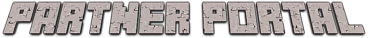

#### 2024-2025 Weekend Project #2

Hey, I'm Parker. I'm a high school student and I write apps in my free time. Currently, I've been trying (and failing)
to keep an Android addition at bay, so this weekend's project is another Android app.

[See Weekend Project #1, SupIR, here.](https://github.com/regulad/SupIR)

# 

TODO: Picture of system online

TODO: Video demo of system

> Get the 3D model for the stand [here](https://www.printables.com/model/1028254-motorola-g4-play-static-stand). I made
> it too!

Partner Portal is an open-source and self-hostable 1-on-1 video chat app. It's designed to run 24/7, perfect for you and
your domestic partner to leave in the corner of your college dorm room or apartment.

To use, simply open the app on both phones and share the same room code. After pressing "Connect," the app will
automatically handle everything else.

## How does it work?

Partner Portal is a pretty typical WebRTC-based video calling app. It uses the public Google STUN servers and Supabase
realtime for signaling.

The app is intended to be as "set and forget" as possible. It will automatically reconnect if the connection is lost (to
a degree), and it will automatically handle the signaling process.

It also features a Minecraft-themed UI, because I thought it would be cute.

## Self-hosting

If you wouldn't like to use the public server, you can self-host the server.

Create a project on Supabase Managed or Supabase self-hosted and insert the URL and Anon key.

## Licenses

The included GPLv3 license applies to all code written by me, unless otherwise noted. Consult Git Blame for authorship information.

Other assets used in this project are subject to their own licenses, as detailed below.

### [Minecraft Font](https://www.dafont.com/minecraft.font)

[DaFont License](https://www.dafont.com/faq.php#copyright)

> Free for personal use. For commercial use, including apps, a commercial licence is required.

### Minecraft Textures & Sounds

[Mojang License](https://www.minecraft.net/en-us/usage-guidelines)

Non-libre, but extremely permissive.
